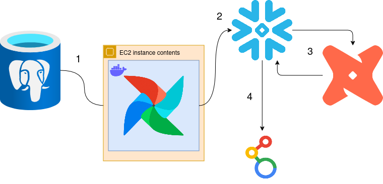

# Data Engineering Project: ETL Pipeline
## 1. Overview:
This project focuses on building an ETL pipeline using various tools and technologies. The primary goal is to extract data from an operational PostgreSQL database, transform it for analytical purposes, and load it into a Snowflake data warehouse for reporting and insights. The pipeline is orchestrated with Apache Airflow, running on an AWS EC2 instance, and the transformations are managed using DBT (Data Build Tool). Finally, a dashboard created with Looker Studio presents the data from the Snowflake data warehouse.

## 2. Business Problem:
The sales department of **NovaDrive Motors** in Brazil, despite achieving excellent results with the sale of over 200 vehicles per day, faces challenges in obtaining reliable and consistent information for performance analysis. The lack of a centralized data structure forces managers to rely on reports generated inconsistently, without clear standards, and with low data reliability. This prevents the sales manager from having a clear view of operations, making it difficult to analyze sales by dealership, by vehicle type, by salesperson, and over time.

This issue directly impacts the management’s ability to make data-driven strategic decisions, hindering efficiency in resource allocation and planning of commercial actions. The solution lies in building a Data Warehouse that centralizes and standardizes sales data, enabling robust and reliable real-time analysis for sales management.

### Disclaimer: 
Nova Drive Motors is a fictional company created for this project, and all data retrieved from the database is entirely fabricated, serving solely for educational and project purposes.

## 3. Tools Used:
- Python 3.10.13
- PostgreSQL
- Apache Airflow
- AWS EC2
- Docker
- Snowflake
- dbt Cloud
- Looker Studio

## 4. Key Components:
- PostgreSQL (Operational Database): the source of the data, a live database that records sales from car dealerships. Data includes vehicles, clients, salespeople, and transactions.

- Airflow (Orchestration Tool): manages the entire pipeline (ELT process). Installed on a Linux virtual machine (EC2) in AWS, using Docker containers for easy deployment. Airflow ensures task dependencies are managed, retries failed tasks, and provides workflow monitoring.

- Snowflake (Data Warehouse): the destination for transformed data, optimized for analytical queries. Designed to handle high-performance analytical workloads. Stores clean, structured data in two layers:
    1. Staging Layer: Raw data is first loaded here.
    2. Analytics Layer: Transformed data, ready for use by managers, sales teams, and directors.

- dbt (Data Transformation): handles the transformation of data from the staging layer to the analytics layer within Snowflake. Allows transformations to be done using SQL, making the process accessible to a wider audience (e.g., business analysts).

- Looker Studio (Data Visualization): A business intelligence tool used to create interactive dashboards. Looker Studio connects to the Snowflake data warehouse to present real-time insights on sales performance, dealership comparisons, and temporal trends.

## 5. Solution:

### Step 1 
Data is extracted from the operational database (PostgreSQL), which stores sales records. For the purposes of this project, we received credentials from the company, which will be used in the next step. We conducted a brief exploration of the data stored in the database to understand the relationships between the tables and began designing the architecture of the Data Warehouse. Next, we created a new instance on AWS and containerized an Airflow application using Docker. We entered the credentials to ensure a proper connection with the database for data extraction, from PostgreSQL to Snowflake. The Directed Acyclic Graph (DAG) was written in Python and can be found in `./dag.py`.

### Step 2
Data is first loaded into a staging area inside Snowflake, replicating the structure from PostgreSQL but optimized for performance. Here, a new Snowflake database novadrive was created, along with the schema stage, to stage data from PostgreSQL. A virtual warehouse DEFAULT_WH was set up to process queries. The tables were created to replicate the structure of the operational database (e.g., veiculos, estados, cidades, etc.), allowing for efficient data ingestion and preparation for analytical processing. The intention was to mirror the existing data structure in a staging area for incremental data loads, ensuring that data transformations can be performed in Snowflake before moving to analytical layers. The script in SQL for references can be find here: `./snowflake.sql`.

### Step 3 
Data in the staging area is transformed using dbt Cloud, ensuring it is properly formatted for analytics (e.g., replacing customer IDs with actual names). The repository contains the models in ./dbt/models and tests in ./dbt/tests. In the models folder, a stage model with view materialization, a dimension model with table materialization, a fact model for sales data, and an analytics model with table materialization were developed. A business rule test was implemented in ./dbt/tests/test.sql, ensuring that discounts do not exceed 5% and that vehicles are not sold for less than their listed price. After the transformations, we connected dbt Cloud to Snowflake and created the analytics schema in production.

### Step 4
The transformed data is stored in the analytics schema in Snowflake, ready for reporting and analysis by business stakeholders. A dashboard was created using data from the analytics layer, which was built with dbt and stored in Snowflake, enabling stakeholders to derive insights and make data-driven decisions.

### Reasons for This Architecture:
1. Isolation of Responsibilities: The pipeline minimizes the impact on the operational database by isolating the data extraction from the transformation process, ensuring smoother performance and reliability.

2. Scalability: Snowflake's architecture is designed to handle large volumes of data efficiently, providing high performance and flexibility as data grows.

3. Modularity: dbt allows for modular, well-structured transformations, making it easier to manage, maintain, and extend as the data and requirements evolve.

## 6. Next Steps:
There are several potential improvements to be made in this project. One key area is the initial data load using Airflow, which can be time-consuming. Implementing a distributed processing tool like Spark could significantly speed up this operation. Additionally, exploring more cost-effective Data Warehouse solutions, such as Google BigQuery, may also enhance performance and reduce expenses for future scaling needs. Furthermore, expanding the implementation of tests with dbt to cover more business rules and data validation could ensure the integrity and quality of the data as it flows through the pipeline.